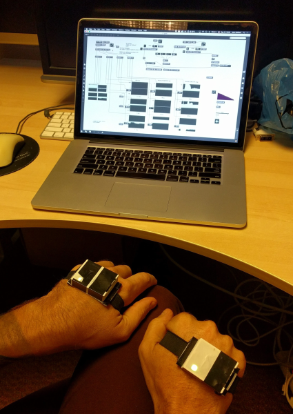

# cirmmt-harp
Repo containing hardware, software and 3d models for use in a CIRMMT student project. There are three members contributing to this project: myself, Jonny Venom, a fellow music technology PhD student at McGill and Alex Tibbitts, a harpist. This repo will contain various digital assets that the project may produce.

## Project idea
In this CIRMMT student project we are experimenting with different ways to augment harp performance. The tools we are using are MARG sensors, motion capture algorithms and other interesting things we come up with.  

## Software
### Programming the wireless MARG module
The main component of the wireless MARG module is an ESP8266 MPU chip. It can easilly be programmed using the Arduino IDE. All you have to do is have a version of Arduino that is `>= 1.6.9` and add the url `http://arduino.esp8266.com/stable/package_esp8266com_index.json` into `Additional Boards Manager URLs` inside `Preferences`.

To program the board you open the `cirmmt-harp.ino` code and in Arduino and choose the following settings under `Tools`:

| Parameter       | Setting                |
| --------------- | ---------------------- |
| Board           | Generic ESP8266 Module |
| Flash mode      | DIO                    |
| Flash frequency | 40MHz                  |
| CPU frequency   | 80MHz                  |
| Flash size      | 512K                   |
| Reset Method    | nodecmu                |
| Upload speed    | 115200                 |

afterwards you can compile and upload the code like you would do using a standard Arduino.

### Interacting with the wireless MARG module
The way the wireless MARG module works is that it takes a static IP address on a wireless network. You then specify a given IP address and port it should stream its data to. You can also supply it with a port that it will listen to for imcoming OSC messages. Then you can send/receive OSC messages over UDP.

#### OSC inputs
Module is listening to OSC messages over UDP on a port defined in `.ino` code under the constant `LISTEN_PORT`. It expects two different OSC messages:

* `/drv effect0, ..., effect7` - effect 0-7 are integer values [0, 123] that determine which effect the DRV2506 haptic driver should render. If less than 8 effects are needed you can halt the skip the remaining effects by placing a -1 value after the last effect you wish to send.
* `/led red green blue` - red, green, blue are inter values [0, 255] that determine the brightness of the onboard RGB LED.

#### OSC outputs
The module is sends a continuous stream of OSC messages over UDP to a port defined in .ino code under the constant `SEND_PORT`. It sends data at a rate defined by the interval `WAIT_WIFI`. The directories it sends data to are the following:
* `/acc acc_x, acc_y, acc_z` - acc_x, acc_y, acc_z are the floating point xyz-axis accelerometer data in g. 
* `/gyr gyr_x, gyr_y, gyr_z` - gyr_x, gyr_y, gyr_z are the floating point xyz-axis gyroscope data in rad/s.
* `/mag mag_x, mag_y, mag_z` - mag_x, mag_y, mag_z are the floating point xyz-axis magnetometer data in Gaussians.
* `/rpy roll pitch yaw` - roll, pitch, yaw are the [-180, 180[ degrees orientation data.
* `/q q0 q1 q2 q3` - q0, q1, q2, q3 are the floating point quaternion orientation data.

## Hardware 

In the future I will put the schematics we made for this project in a sperate folder.

## 3D models
3D models for 3D printing will also be provided so that you can print out an enclosure yourself!